### Hi there! 👋 I'm Han Yan, a passionate full-stack developer from NYU.

 

## 📫 How to reach me:

- [Email](mailto:yanhan0121@gmail.com)
- [LinkedIn](https://www.linkedin.com/in/han-yan-b90840249/)
<!--
**barryyan0121/barryyan0121** is a ✨ _special_ ✨ repository because its `README.md` (this file) appears on your GitHub profile.

The GitHub stats cards above are generated into local SVG files by `.github/workflows/update-readme-cards.yml`.
This avoids depending on the public github-readme-stats Vercel endpoint, which can return 503 or hit rate limits.
-->
